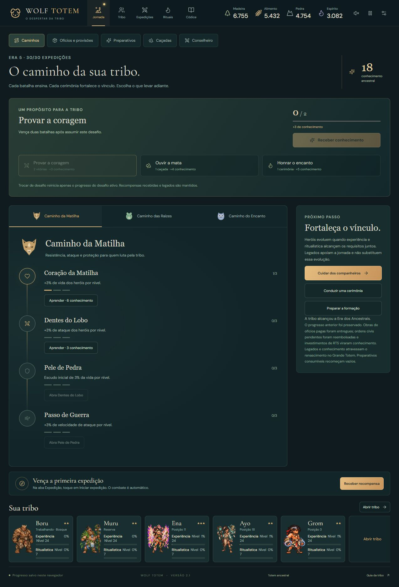
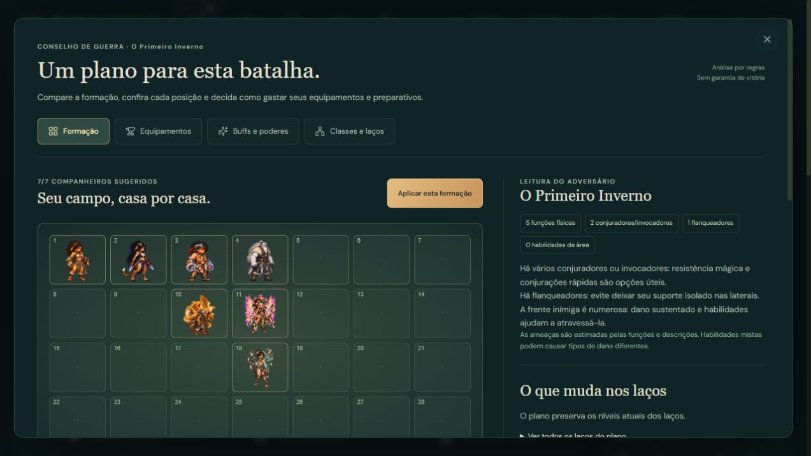
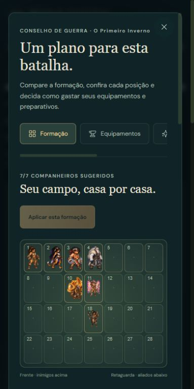

> Registro de uma versão anterior. As regras atuais estão em [Reformulação 2.2](REFORMULACAO-2.2.md); economia, construções, custos de rituais e trabalho descritos abaixo foram retirados.

# Caminhos Ancestrais — versão 2.1

A Jornada substitui a gestão de aldeões, terrenos, construções civis e pesquisas de RTS. O ciclo passa a ser: escolher um desafio, jogar batalhas ou realizar atividades, receber conhecimento, aprender legados e preparar a próxima expedição.

## Desafios e legados

Só contam atividades realizadas após aceitar o desafio. Trocar de desafio reinicia seu progresso parcial. Cada recompensa pode ser recebida uma vez por desafio; depois é possível aceitá-lo novamente.

| Desafio | Objetivo | Conhecimento |
| --- | --- | --- |
| Provar a coragem | Duas vitórias | 3 |
| Ouvir a mata | Uma caçada concluída, inclusive offline | 4 |
| Honrar o encanto | Uma cerimônia concluída, incluindo a roda de cacau | 5 |

A jornada começa com 3 conhecimentos. Cada legado tem três níveis, com custos de 3, 6 e 9. Os seguintes exigem o anterior no nível 1 e a era indicada na interface.

| Caminho | Legados e efeito por nível |
| --- | --- |
| Matilha | Vida +3%; ataque +3%; escudo inicial de 3% da vida; velocidade de ataque +3% |
| Raízes | Produção +8%; XP de atividades +4%; chance de caçada +2 pontos percentuais; produção de componentes +10% |
| Encanto | Poder de habilidade +4%; XP ritual +4%; resistência mágica +4 e proteção contra perdas de incursão +4%; mana inicial +5 |

Legados e conhecimento persistem no renascimento. As duas barras dos heróis continuam independentes: 2★ pede experiência 8 e ritual 3; 3★ pede experiência 24, ritual 8 e ayahuasca concluída. Legados apoiam esse processo.

## Provisões e preparativos

Os seis ofícios mantêm produção automática, melhoria imediata e progresso offline limitado a 12 horas. Ajudantes são companheiros da reserva: trabalhar concede XP e os retira da formação. Um ajudante retorna ao ofício após sua cerimônia quando a vaga está livre.

Preparar uma carga cobra o custo mostrado. Há até cinco cargas por tipo e até dois tipos selecionados. Uma partida válida de campanha ou Caçada Eterna consome uma carga dos selecionados, depois de validar a formação. Incursões contra a tribo não consomem estoque. Os efeitos duram a batalha inteira e o conselheiro conserva a lista dos buffs ativos depois do consumo.

| Preparativo | Efeito para os heróis da formação |
| --- | --- |
| Banquete da partida | +12% de vida |
| Pintura de guerra | +8% de ataque |
| Fumaça do encanto | +12 de mana inicial |
| Resina de casca | +12 de armadura |
| Amuleto de proteção | +15 de resistência mágica |
| Água da nascente | Regenera 0,5% da vida máxima por segundo |

Preparativos não usados ficam no estoque. O renascimento esvazia as cargas. Preparar, selecionar e aprender legados ficam bloqueados durante combate ou pausa.

## Conselho de guerra

1. **Formação:** escolhe companheiros disponíveis e mostra as 28 casas, posição atual e sugerida, função, motivo e vizinhos de escudos. Considera níveis, estrelas, equipamentos, até duas prioridades, laços e funções inimigas. Mostra ganhos e perdas de níveis de laços. Aplicar usa as posições exibidas.
2. **Equipamentos:** distribui somente itens completos da bolsa em vagas livres da formação atual. Cada entrada é reservada uma vez; equipamentos existentes permanecem. Receitas reservam componentes e vagas do destinatário. Forjar atualiza as sugestões antes da próxima decisão. A inspeção individual permite equipar e devolver itens.
3. **Buffs e poderes:** ordena preparativos disponíveis na era, explica sua utilidade e mostra custos, estoque e seleção. Lista os efeitos dos rituais de cada herói, legados ativos, passivas dos espíritos e momentos sugeridos para usar seus poderes.
4. **Classes e laços:** explica seis funções táticas e os 31 laços, seus níveis, efeitos e membros. Mostra companheiros disponíveis para acolher e os membros que faltam para avançar o laço. Priorizar um laço influencia o plano; o bônus depende da formação real.

Planos desatualizados, pausa e combate bloqueiam a aplicação antes de alterar heróis ou itens. Heróis em atividades ou trabalhando não entram nas sugestões. Os escudos de vizinhança usam o raio de 1,1 célula da simulação.

### Limites das sugestões

A seleção usa pontuação e trocas locais. Ela não simula todos os confrontos nem garante vitória. Ameaças físicas, mágicas, de controle e de área são estimadas pelas funções e descrições; habilidades mistas podem causar danos diferentes. A Caçada Eterna usa o próximo elenco real. O jogador pode ajustar o plano, escolher equipamentos e decidir o momento dos poderes.

## Saves anteriores

O formato é v6 e o jogo aceita v1 a v6. Heróis, estrelas, XP, rituais, equipamentos, eras e campanha são preservados. A conversão de RTS é realizada uma vez:

- melhorias de ofícios já pagas e pendentes são entregues;
- custos de ordens civis pendentes são reembolsados, com deduplicação de IDs;
- infraestrutura, pesquisas e população extra geram conhecimento, limitado a 60 pela migração;
- prioridades de laços válidas são mantidas;
- novos saves gravam a Jornada e deixam de gravar o estado de RTS.

Exportar e importar usa o mesmo formato v6. A migração não repete créditos quando um save convertido é reaberto.

## Verificação

Testes de regras cobrem desafios reais e offline, custos e limites, efeitos na simulação, migração e sanitização, renascimento, distribuição global, capacidade das receitas, planos desatualizados, todas as 55 funções e casas válidas, vizinhança de escudos e Caçada Eterna. Os testes existentes de combate, animação, campanhas, atividades e despertar continuam na suíte.

Na interface, o cenário de teste importado usa nove heróis de 1★ a 3★ e um save v5 com obras pendentes. Foram conferidos aplicação de formação, distribuição, forja, melhorias imediatas, ajudantes, prioridades e consumo de preparativos. As capturas abaixo usam esse cenário de teste.

Validação em 8 de outubro de 2026: **298 testes em 12 arquivos passaram**, e o build de produção com TypeScript e Vite passou. O save v6 exportado pela interface foi carregado na versão de produção, preservando a jornada. Duas vitórias reais completaram o desafio e a recompensa concedeu 3 conhecimentos. Jornada e conselheiro foram conferidos em 390 × 844, sem transbordamento horizontal; os registros do navegador não mostraram avisos ou erros.

