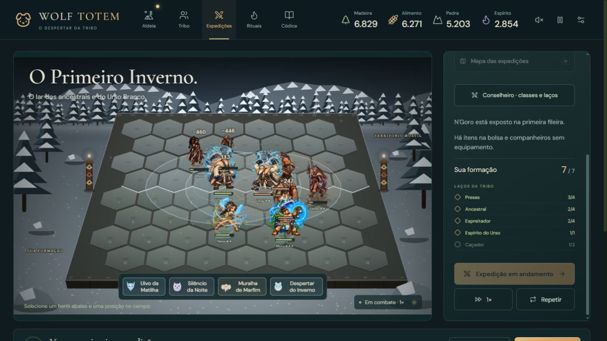
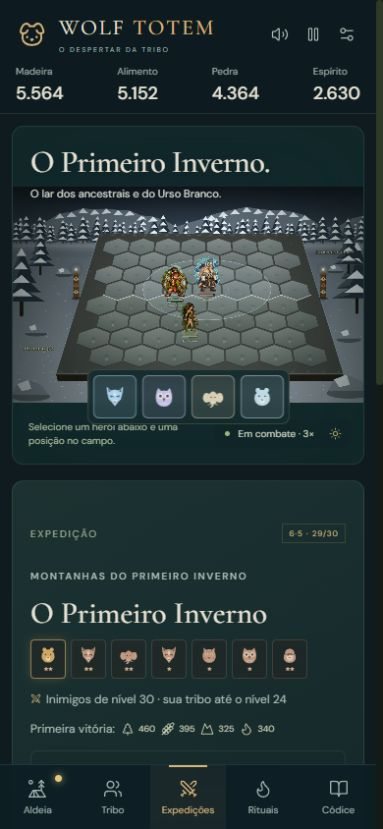

# Combate e animações

## O que mudou

O dano dos ataques básicos agora acompanha uma preparação curta. Golpes corpo a corpo resolvem ao final dessa preparação; ataques à distância lançam um projétil e resolvem quando seu tempo de viagem termina. Atordoamento ou morte cancelam uma ação ainda em preparação. Um projétil já lançado pode atingir depois da morte do atirador enquanto a batalha continua. Habilidades têm preparação própria antes de executar suas regras existentes.

Os 55 heróis possuem perfis de arma, peso, passada, alcance visual, cor e família de habilidade. As 165 formas usam esses perfis. Personagens pesados e ágeis têm movimentos diferentes. Ataques têm antecipação, impulso e recuperação; há reação ao impacto, queda, vitória, sombras, poeira de passos, rastros de conjuração e transição das transformações. Ressurreição restaura o perfil do personagem.

As habilidades combinam partículas específicas, efeitos já existentes e um novo atlas pintado com 16 quadros: garra espiritual, veneno, gelo e sigilo. As 33 famílias de habilidade variam trajetórias e elementos, incluindo folhas, penas, gotas, estilhaços, raios, invocações e áreas. Essas quatro sequências pintadas são compartilhadas pelas famílias; não representam 55 novas animações exclusivas.

Escudos, veneno, marca, lentidão, atordoamento, furtividade e transformação têm sinais visuais. A vida perdida deixa uma faixa que recua suavemente. Clarões foram reduzidos para preservar as cores dos sprites. Números e tremores têm limites. Apenas chefes exibem o nome da habilidade acima do campo, evitando uma nuvem de textos.

Há sons sintetizados por arma e família de poder, com posição estéreo, limite de frequência e controle de volume. O som respeita a preferência de silêncio do jogador.

## Regras e apresentação

- Preparação, viagem e impacto pertencem à simulação, em `combatTiming.ts` e `simulation.ts`.
- A separação dos corpos ocorre em cópias das posições no renderizador. Isso melhora a leitura sem alterar alcance, alvos ou deslocamento das regras. Aplicar essa separação na simulação prejudicou o confronto do Rei dos Búfalos e foi descartado.
- Partículas usam um gerador próprio, sem consumir aleatoriedade da partida. Há até 240 partículas em telas amplas e 120 em telas estreitas, 24 projéteis, 32 emissões pendentes e oito sequências pintadas simultâneas.
- A pausa impede consumo de eventos e criação de novos tweens. Movimento, partículas e quadros acompanham a velocidade de combate. Efeitos são limpos ao trocar de batalha ou sair do campo.
- Movimento reduzido diminui partículas e duração dos efeitos, remove rastros e tremores. Os quatro poderes ficam em botões de 44 px no celular, preservando o campo e os nomes acessíveis.
- A evolução por experiência e ritualística continua nas regras existentes. As batalhas e suas filas temporárias não entram no save.

## Avaliação crítica

O problema principal era de sincronização: o dano aparecia antes de uma ação legível, os corpos se sobrepunham e efeitos parecidos escondiam as diferenças entre heróis. O trabalho melhora esses pontos e dá mais peso às ações.

A base artística dos personagens ainda tem sequências curtas de quatro poses por ação. Conjuração, impacto, morte e vitória usam essas poses com movimento procedural; não são novas sequências corporais longas desenhadas quadro a quadro. Alguns movimentos especiais continuam representados por deslocamento, rastros e partículas. Os sons são síntese, sem gravações de foley. O cenário continua com geometria estilizada. Portanto, este acabamento não equivale à produção artística de um jogo AAA.

O próximo salto de qualidade artística exige mais poses específicas por arma e personagem, transições corporais desenhadas, ataques especiais com silhuetas próprias e áudio produzido. Isso deve partir de aprovação visual de cada animação; aumentar a quantidade de clarões não resolve a falta de poses.

## Verificação

- 294 testes em 12 arquivos, incluindo habilidades nas 55 × 3 formas, interrupção, projéteis após morte, pausa das regras, limpeza entre batalhas, perfis e redução de movimento.
- Testes existentes de campanha, itens, sinergias, espíritos, cerimônias e Rei dos Búfalos mantidos. Expectativas de balanceamento não foram enfraquecidas.
- Build de produção com TypeScript e Vite.
- Oito formações abertas pelo fluxo normal de importação em uma origem de QA separada, cobrindo os 55 personagens com estrelas variadas. Isso verifica carregamento e início do combate; não equivale à inspeção manual de cada habilidade em todas as estrelas.
- Combates observados com invocações, poderes espirituais, projéteis, transformações, números e estados. Console sem erros nas verificações.
- Pausa verificada por duas capturas idênticas após estabilização da transição da interface. Velocidade 3× e movimento reduzido conferidos.
- Tela de 390 × 844: corrigida a barra de poderes que cobria o campo. Não há certificação de desempenho em aparelhos físicos.
- Atlas RGBA de 1254 × 1254, 16 retângulos de frame dentro dos limites e transparência real em todos os quadros. A divisão usa limites explícitos porque o tamanho não é divisível por quatro.

## Proveniência do novo atlas

Arquivo: `public/assets/environment/combat-spell-atlas.png`, acompanhado por `combat-spell-atlas.json`. Gerado com a ferramenta integrada de imagens, seguido de uma edição para melhorar a contenção nas células. O PNG final foi copiado sem alteração; o código apenas registra os recortes. As ilustrações e os atlases dos personagens foram preservados.

### Prompt de geração

Use case: stylized-concept. Asset type: production animated visual-effects sprite atlas for Wolf Totem, a primitive spiritual fantasy tactical auto-battle game. Create ONE transparent PNG atlas with EXACTLY 4 columns and 4 rows, 16 separate frames, equal square cells, perfectly evenly spaced, no frame overlap, no borders, NO TEXT. Each ROW is a single coherent four-frame animation progressing left to right: row 1 a pale blue spirit-wolf claw crescent strike, row 2 an emerald green serpent venom ribbon and liquid splash, row 3 a pale cyan ancestral ice eruption with crystalline shards, row 4 a warm gold and teal shamanic ground sigil with rising spiritual light. The four chronological frames in every row: 1 small charge, 2 developing motion, 3 full impact, 4 dissolving wisps and particles. Preserve same effect identity, center, orientation and palette through the four frames. Effects only: absolutely no character, no person, no animal body, no background scenery, no labels or interface. Polished painterly game VFX with layered translucent energy, soft glow confined to the effect, crisp readable silhouettes, textured magical strokes and volumetric wisps, high quality dark fantasy action game visual treatment. Transparent EMPTY canvas including all gutters; never render a checkerboard or a black backdrop. Leave 10 percent transparent margin inside every cell. Side-facing three-quarter game view for the crescent and venom, low isometric ground plane for ice and sigil. Atlas is square; each effect fully contained in its assigned cell. All 16 frames must be clearly distinct motion stages rather than repeating identical icons. The output is an actual gameplay sprite sheet, not a poster or presentation.

### Prompt de edição

Edit this production VFX sprite atlas. Keep EXACTLY the same 4-column by 4-row, 16-frame layout, the same four effects and four chronological stages per row, the same painterly detail and colors. The only correction is strict sprite-cell containment: shrink every effect uniformly within its own equal square cell so ALL colored pixels and glow are contained inside an 80 percent centered area of that cell, leaving a genuine transparent 10 percent margin on ALL FOUR SIDES in every cell. No effect may overlap a neighboring frame, no glow may touch any cell boundary. Preserve the alpha background as genuinely transparent; no black fill, no checkerboard. Keep all sixteen effects complete, no truncation. Rows remain blue claw crescent, green serpent venom, cyan ice eruption, gold/teal ground sigil; four progressing motion stages per row. No characters, scenery, text, labels, separators or outlines. Maintain a square canvas and identical cell dimensions. This is an animation atlas for a game engine, precise gutters matter.
