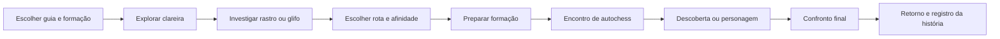

# Travessias do Encanto

Pesquisa e proposta de design — 8 de outubro de 2026. **Este modo ainda não foi implementado.** A reformulação já disponível está descrita em [Wolf Totem 2.2](REFORMULACAO-2.2.md).

## Recomendação

Adicionar travessias de exploração 2D em que o jogador conduz um herói pelo cenário, investiga rastros, resolve pequenos desafios e decide por onde a tribo seguirá. Os encontros de combate usam a formação de autochess existente. A novidade está em caminhar, observar, interagir e escolher caminhos que mudam os próximos encontros.

Meta inicial: sessões de 15 a 25 minutos, com progresso salvo a cada descoberta e possibilidade de interromper a travessia. Esses tempos são objetivos de design, ainda sem medição.

## O que a pesquisa mostrou

| Referência oficial | Mecanismo observado | Aplicação proposta |
| --- | --- | --- |
| [Heaven’s Vault, da inkle](https://www.inklestudios.com/heavensvault/) | Exploração livre, interpretação de glifos que altera o rumo da história e personagens que reagem às escolhas. | Rastros e símbolos fictícios do mundo do jogo revelam rotas e histórias dos heróis. Uma interpretação inesperada abre outro encontro. |
| [Diário de eventos de Slay the Spire 2, da Mega Crit](https://www.megacrit.com/news/2025-6-12-neowsletter-issue-11/) | Eventos com escolhas ligadas ao estado da partida e consequências favoráveis ou desfavoráveis. A apresentação usa arte, animação e efeitos. | Decisões com benefício e custo visíveis, adaptadas à formação, ao terreno e aos ritos já aprendidos. |
| [Hades FAQ, da Supergiant](https://www.supergiantgames.com/blog/hades-faq/) | Novas combinações de poderes e desafios entre jornadas, com história em episódios e personagens que lembram do jogador. | Afinidades temporárias variam cada travessia; descobertas e relações com personagens continuam entre visitas. |

As características da segunda linha vêm de um diário publicado em junho de 2025. A recomendação abaixo é uma síntese própria para Wolf Totem; os títulos citados não validam o balanceamento ou a duração propostos.

## Uma travessia completa

### Exploração e interação

- Um herói guia caminha com clique, toque ou WASD. Companheiros o acompanham pelas animações existentes.
- Cada pequena área tem dois ou três elementos relevantes: rastros, uma passagem, símbolos, um personagem ou um fenômeno espiritual.
- O jogador observa pistas no cenário e interage perto delas. O primeiro desafio pode ser seguir uma sequência de pegadas; o segundo, reconhecer símbolos vistos durante o percurso.
- Toda interação oferece resposta visual e sonora: vegetação movendo, glifos acendendo, reflexos no rio e reações dos companheiros.
- Uma dica progressiva permite avançar quando o jogador não entende um desafio. A interpretação altera a rota; errar uma pista não exige reiniciar a sessão.

### Decisões que afetam a estratégia

As rotas mostram a consequência conhecida antes de confirmar. Exemplos:

| Escolha | Benefício | Consequência |
| --- | --- | --- |
| Subir pela crista | Revela as posições inimigas do encontro seguinte | O encontro possui dois atiradores adicionais |
| Seguir o leito do rio | Abre uma afinidade de proteção para a primeira conjuração inimiga | A formação começa com menos mana |
| Investigar o tronco marcado | Abre uma cena pessoal do guia e uma rota de descoberta | Enfrenta um encontro opcional antes do chefe |

Os valores exatos precisam de teste. A interface mostra aliados e inimigos antes da luta e permite reorganizar heróis, itens e bênçãos entre encontros.

### Afinidades da travessia

São efeitos temporários obtidos ao explorar. Duas vagas por travessia bastam para o protótipo. Cada efeito modifica uma situação específica, como revelar o flanco adversário ou proteger um aliado quando recebe a primeira habilidade.

As bênçãos permanentes continuam ligadas aos rituais. As afinidades terminam no retorno. A interface apresenta separadamente o que foi aprendido pela tribo e o que só acompanha aquela travessia.

### Recompensas e história

XP de atividades, componentes, descobertas no códice e elementos visuais são recompensas possíveis. Conhecimento vem da primeira descoberta de marcos definidos, com limites claros. Estrelas e vínculo ritual continuam exigindo as duas barras e as cerimônias atuais.

Uma história curta do guia avança por capítulos. Voltar ao mesmo lugar mostra consequências das decisões anteriores e pistas novas, com registro para quem retorna depois de alguns dias.

## Primeira área: Travessia do Igarapé

Construir uma área compacta com seis pontos de interesse conectados por três rotas. O jogador entra numa clareira, escolhe entre a crista e o rio, encontra rastros, atravessa um pequeno desafio e chega ao guardião do lugar.

Escopo inicial:

- Um bioma, com clareira, margem e passagem espiritual.
- Três guias do elenco existente, com uma interação pessoal cada.
- Dois desafios ambientais: pegadas e símbolos.
- Seis eventos e seis afinidades temporárias.
- Dois encontros normais de autochess e um chefe.
- Um final que registra a rota e a escolha do guia.

O mapa precisa ser percorrível e ter espaços para observar. Os eventos aparecem junto aos personagens e objetos do cenário; os menus resumem decisões e recompensas.

## Integração com a base atual

O Phaser pode reutilizar os atlas de caminhada, ataque, efeitos e personagens. Uma cena de exploração cuidaria do cenário, movimento e interação; um módulo puro de travessia guardaria rota, escolhas, semente e descobertas. A simulação de combate existente resolveria os encontros.

O save deve registrar cada interação concluída e cada recompensa aplicada uma única vez. Sair durante um desafio mantém a travessia no mesmo ponto. O ciclo de integração ritual e as atividades offline atuais continuam independentes.

## Por que priorizar isso

| Alternativa | O que acrescenta | Avaliação para este jogo |
| --- | --- | --- |
| Sequência de chefes | Novos testes de composição e equipamento | Boa expansão posterior do combate |
| Jogo de cartas | Uma segunda camada de montagem de combinações | Exige outro sistema extenso para cumprir função próxima à formação |
| Travessias com exploração | Movimento, observação, personagens e decisões ambientais | Amplia os tipos de interação e dá contexto aos combates e rituais |

**Próximo passo recomendado:** produzir apenas a Travessia do Igarapé e testar se as pessoas entendem as pistas, lembram das consequências e mudam a formação entre encontros. Expandir biomas depois dessa confirmação.

Critérios do protótipo: funcionar com teclado e toque; salvar e retomar; explicar custos e benefícios das escolhas; oferecer dicas; variar pelo menos dois encontros conforme a rota; manter a evolução de estrelas no ritmo de dias já definido para o jogo.
