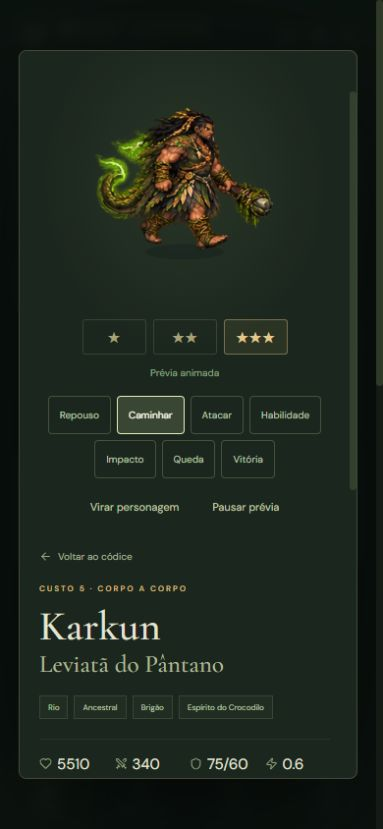
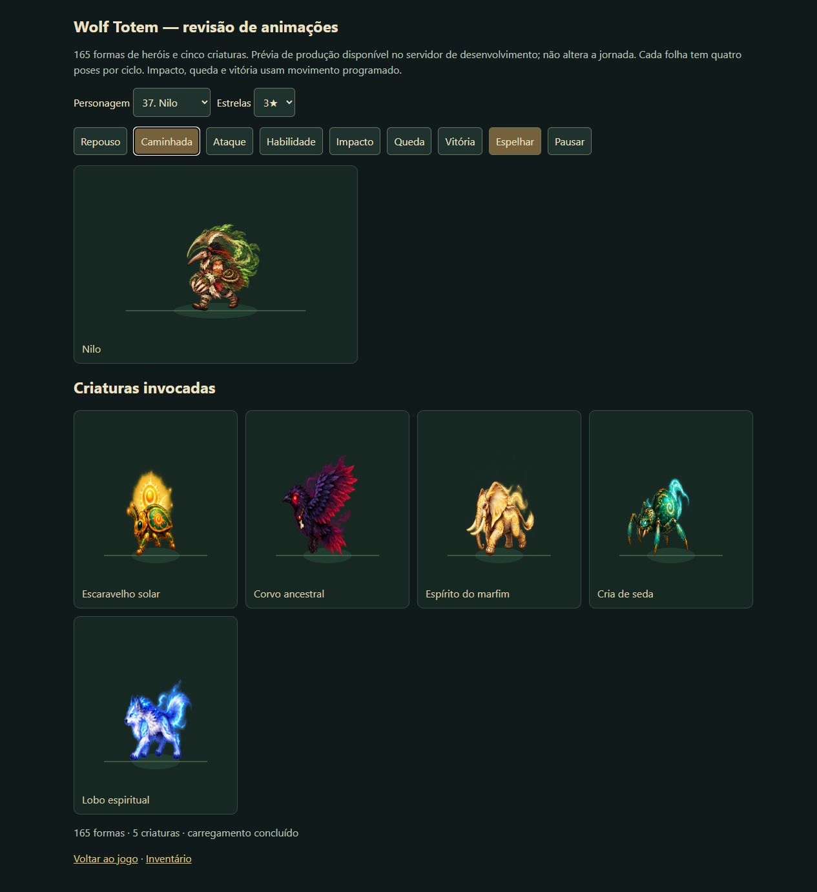
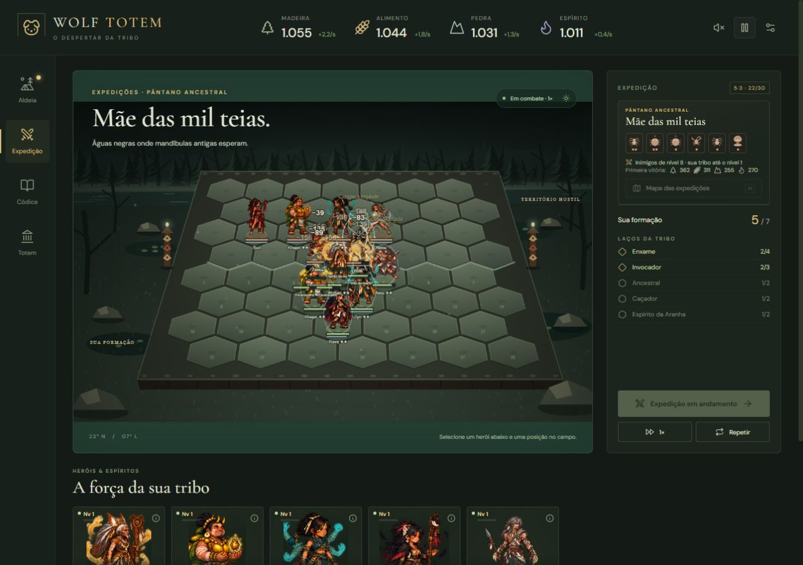

# Produção visual — 7 de outubro de 2026

## Entrega

A auditoria inicial encontrou 79 das 165 formas. Foram produzidas as 35 formas 2★ e as 51 formas 3★ restantes, além das cinco criaturas invocadas. O catálogo atual contém **55 personagens completos nas três estrelas** e **cinco criaturas com folhas próprias**.

| Grupo | Folhas | Sequências pintadas | Poses |
| --- | ---: | ---: | ---: |
| Heróis 1★, 2★ e 3★ | 165 | 495 | 1.980 |
| Invocações | 5 | 15 | 60 |
| Total | 170 | 510 | 2.040 |

Cada folha tem 12 poses: repouso, caminhada e ataque/conjuração, quatro poses por sequência. Ataque e habilidade compartilham desenhos; impacto, queda e vitória usam o sistema de movimento do jogo. São assets de protótipo integrados, com margem para polir a fluidez e a anatomia de cada evolução.

## Origem e preparação

- Geração pelo Imagegen integrado, usando as artes anteriores como referência e as descrições canônicas de `src/data/characters.ts`. Os 39 PNGs originais em `chars` foram preservados.
- As novas formas 3★ partiram das respectivas formas 2★. Os prompts mantêm rosto, vestuário e arma e pedem a manifestação do animal descrita no catálogo.
- As criaturas usam referências dos respectivos invocadores: Zyri, Rava, Khepri, Fenra e Mahari. O tipo `wolf` é usado pelos lobos do Alfa no jogo; sua folha foi produzida como lobo espiritual azul. Os ecos usam a forma do personagem copiado.
- PNGs foram copiados sem editar pixels. `measure-atlas-b.py` mede transparência, recortes, âncoras e retrato e grava os metadados. Cada folha aceita precisa conter 12 quadros com margens transparentes.
- Folhas com efeitos sobrepostos receberam nova geração com mais espaço. Isso incluiu Sesha, Akh'ra, corvo, escaravelho e lobo. Nilo foi regenerado para corrigir o animal para tamanduá.

Prompts e caminhos das saídas aceitas:

- [35 formas 2★](visual-2026-10-07.jobs.json)
- [51 formas 3★](visual-2026-10-07.s3.jobs.json)
- [cinco invocações](visual-2026-10-07.summons.jobs.json)

O inventário completo fica em [STATUS.md](STATUS.md). `asset-queue.mjs` retorna uma fila vazia para as formas dos heróis.

## Integração

O registro dos heróis usa `characterId:stars`. As criaturas ficam em registro separado por `summonId`, em `public/assets/animations/summons`; o campo carrega os PNGs sob demanda e aplica os mesmos tempos, recortes e âncoras usados pelos heróis. O controle de descarte de texturas conserva as criaturas ativas. Os desenhos procedurais permanecem disponíveis durante o carregamento. Não houve alteração nas regras de combate, atributos ou progressão.

Uma [galeria de revisão](preview.html) permite escolher qualquer personagem e estrela e observar as cinco criaturas simultaneamente. Com o servidor de desenvolvimento ativo, abra `/docs/production/preview.html`. Essa página usa os registros e o modelo de movimento do jogo, sem acessar a jornada. Ela não é incluída no build de produção.

## Verificação

- **242 testes em oito arquivos passaram**; TypeScript e Vite compilaram sem erros.
- `npm run roster:status -- --write --complete` confirmou 165/165 formas e 5/5 criaturas.
- Todas as novas folhas passaram pela medição de margens, quadros e âncoras. Os testes verificam PNG, dimensões, retrato, registro e clipes dos 170 atlas.
- Sesha 3★: caminhada, ataque, espelhamento, pausa e retomada no códice, em desktop.
- Akh'ra 3★: habilidade no códice. Nilo 3★ e as cinco criaturas: caminhada e ataque na galeria.
- Karkun 3★: prévia em viewport de 390 × 844, com controles acessíveis e sprite visível.
- Formação de QA com Mahari, Khepri, Zyri, Rava e Akru importada em `localhost` pela interface. Durante Mãe das mil teias, os PNGs de elefante, escaravelho, aranha e corvo foram carregados sob demanda. O lobo foi observado na galeria; a luta com o Alfa não foi repetida nesta verificação.
- Console das abas de QA sem erros. A inspeção visual em movimento foi por amostragem, além da validação geométrica de todas as folhas.

### Evidências

Formação reproduzível em `tests/fixtures/visual-summons.json`. Importar esse arquivo substitui a jornada da origem usada; a QA foi feita em uma origem local separada.
